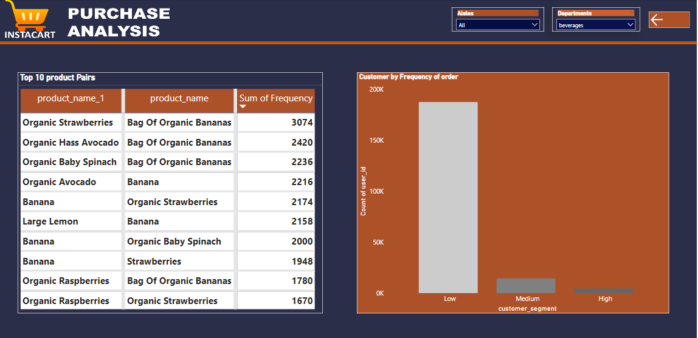

# Instacart_Customer_Behaviour_Analysis

--

## Introduction
A brief background on the company called Instacart. They are an e-commerce platform that's aimed at providing customers with seamless shopping experience. However, they quickly realized that they needed to understand their customers’ shopping behavior to enhance their experience. So, they decide to explore transactional data from their platform to derive valuable insights.

As the data analyst handling this project, The goal is to understand customer shopping behavior and derive insights that would help. I recognized the vast amount of data at my disposal, and I sought to analyze it in a way that would be useful. I opted to approach the project using 3 methods with focus on the most recent orders.

- Market Basket Analysis
- STA (Seasonal Trend Analysis)
- Customer Segmentation

## Tools
- SQL
- Power BI

## Skills Demonstrated
Advanced SQL Manipulation techniques
- Joins
- Subqueries
- Case Statement
- CTE

## Cleaning and Preliminary Analysis
Once I had the data loaded in sql server, I proceeded to first change the datatypes of the different columns in the tables.

- Next I handled the NULL values, the day_since_prior order column in the Orders table contained quite a number of NULLs but I decided to keep them, in the ocntext of this analysis, the NULLs signified firs time orders of specific cutomers.

- The order_dow column in Orders table had day of the week in number format with (0 = Sunday, 1 = Monday ......). I decided to convert the values to actual day names so I don't have to do that later in the project.

That said the table summary is as follows
- Aisles table  134 Rows, 2 columns
- Department    21 Rows, 2 columns
- orders        3.4M Rows, 7 columns
- Products     4,457 Rows, 4 columns
- order_product_prior 3.2M Rows 4 colums
- order_products_train  1.3M Rows 4 columns

## Database ERD

Okay so lets dive in ....

## Market Basket Analysis

This a technique that is used to identify patterns in customer purchasing behavior, basically market basket analysis makes it possible to find items that customers are most likely to buy together. for this use case, I employed this technique to identify the products Instacart customers mostly purchase together.

_**Top 10 product pairs that are most frequently purchased together**_

 

From the table above, its quite clear that customers of instacart love their bananas. bananas are featured in all but one pair on the list.

_**Top 5 products that are most commonly added to the cart first**_

The chart shows that **Banana** is the most frequently added item to customers' shopping carts, with over **4,000** instances of it being the first item added. **Bag of Organic Banana** comes in second with just under 4,000 instances, and **Organic Whole Milk** is a distant third with slightly over 1,000 instances. This data further confirms the popularity of bananas among customers.

## Customer Segmentation

Customer segmentation is a technique that is simply used to group customers into different categories based on number of different criteria , for this particular use case, I will attempt to segment customers based on the frequency of purchase, I have grpup them into High, Medium and Low frequencey.

_**Different customer segments based on purchase frequency**_

Majority of Instacart customers in the 30-day review period made low purchases in terms of order count. This is based on the segmentation of customers who have placed orders 70 times or more as high, between 40 and 69 as medium, and below 40 as low.

## STA

Seasonal trend analysis is a time series analysis technique that helps identify trends, patterns, and seasonality in data 1. It involves separating a time series into its underlying components: trend.

_**Time period of the day in which orders were made**_

Between 12AM and 5AM, there is very little activity in terms of orders, which is understandable as most people are asleep during this period. Activities begin to pick up from around 5:15AM and continue to rise until they peak at 10AM. Instacart customers are most active at 10AM and remain relatively calm between then and 3PM. After 3PM, the activity begins to drop and continues to do so until 11PM.

_**Days since prior purchase**_

The data suggests that a significant number of Instacart customers place orders only once a month. The sharp increase in orders at 7, 14, 21, and 28 days indicates that many customers reorder weekly or every two or three weeks on the same day. It’s also surprising that the number of customers who haven’t placed any order for 30 days or more is quite high.

## Visual Summary

## Insights and Recommendation

- Instacart’s customer base has a significant portion of customers who order infrequently. To attract these customers, you can create a marketing campaign that offers discounts 
  on products based on the number of orders made over a period of time.
  
- Bananas are a popular product among Instacart customers, regardless of whether they are organic or not. To ensure customer satisfaction, it is recommended that you keep 
  bananas in stock at all times. Any drop in availability could prove costly.
  
- The peak period on the platform is between 10AM and 3PM, with more than 200,000 orders being placed within this period. To maximize the effectiveness of your advertising 
  campaigns or vendor discounts, it is recommended that you target this window as this is when customers are most active.

-  While a good number of customers return every week to place orders, there are more customers who make purchases only once a month. To understand why these customers return 
   just once a month, you can conduct a survey. It may not necessarily be a bad thing if they make purchases in bulk that last through the month, or it could be that they make 
   purchases elsewhere. A survey will help clarify that.

## Data Limitation

- The data available for analysis did not include information on the amount spent by customers, therefore, it was not possible to segment customers based on that.
  
- If we had access to customer age information, we could gain insights into whether the age group of customers had any correlation with the time of day in which orders were made.
  However, this is just a hypothetical scenario as we do not have access to customer age information in this analysis .

## Conclusion

The platform is performing well, with a customer base of over 200,000 and 3 million orders in any given 30-day period. These are impressive numbers that demonstrate the platform’s success. However, there is always room for improvement. I recommend that the company take a closer look at the recommendations made in order to enhance the overall customer experience on the platform.

_**Cheers**_

